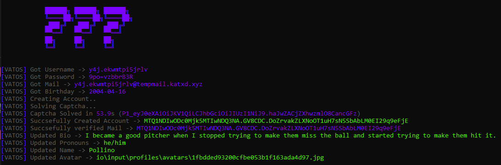

  

  <h3 align="center">??? Token Gen </h3>

  

    For Developers Only - Ready To Use
     
     
    <a href="https://discord.gg/hM5VE7XDKr">Discord Server</a>
    <a>‎ ‎ Star to support ⭐</a>
  

 

## Screenshot

## Features 
- **`Broswer Based Hcaptcha Solving`** - Browser Based Hcaptcha Solving on own html file
- **`Verifying Discord Accounts`** - Verifies Discord Accounts By Mail API
- **`Humanizing Discord Accounts`** - Humanizes Discord Tokens
- **`Token Generation`** - Unlocked, High Quality Discord token

## Tech Stack
- Python
- Javascript

## Contributers

- **`VatosV2`** - Head Developer
- **`zkamo`** - Hes js here

